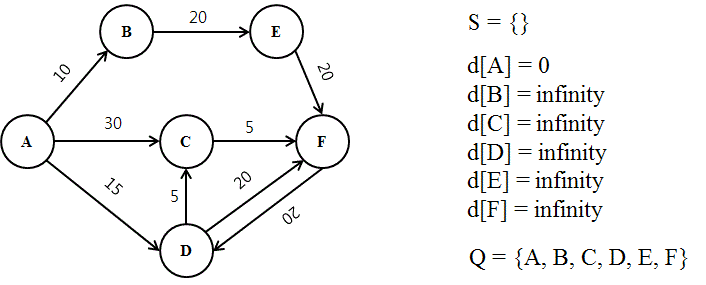
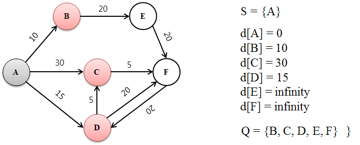
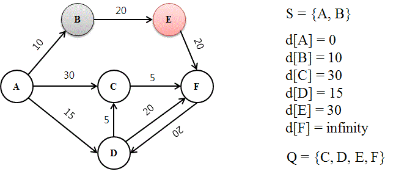
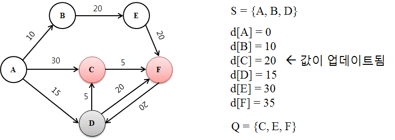
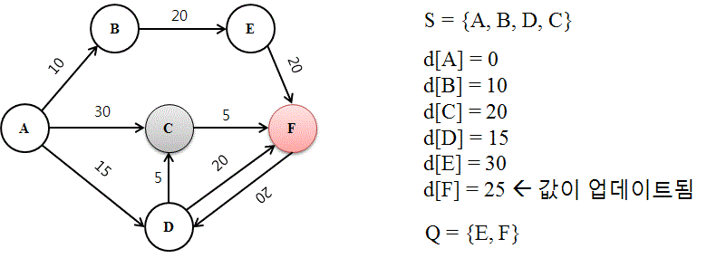

# 다익스트라 알고리즘

- 시작 정점에서 거리가 최소인 정점부터 선택해 나가면서 최단 경로를 구하는 방식( Greedy)
- 최소 신장 트리를 구하는 `프림 알고리즘`과 유사
- 시작 정점(r)에서 끝 정점(t)까지의 최단 경로에 정점 x가 존재한다면, 최단경로는 r에서 x까지의 최단 경로와 x에서t까지의 최단 경로로 구성된다는 것이 핵심
- 음의 가중치가 있는 경우 사용할 수 없다.

## 순서

1. __아직 확인되지 않은 거리는 무한으로 설정한다.

   

   

2. __이웃 노드를 방문하고 거리를 계산한다.__

   

   

3. __거리가 가장 짧은 노드에 방문하고 경로를 확정한다. (A - B)__

   

   

4. __거리가 다음으로 짧은 노드에 방문하고 경로를 확정한다. (A - D)__
   __확정되지 않은 경로 중 더 짦은 경로를 발견하면 값을 갱신한다. (A - D - C)__

   

   

5. __목표 노드에 도달할 때 까지 반복한다.__

   

