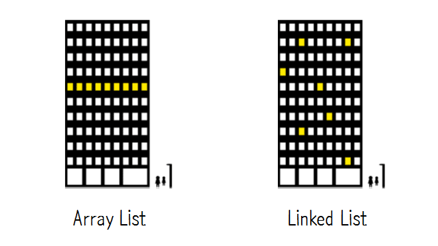
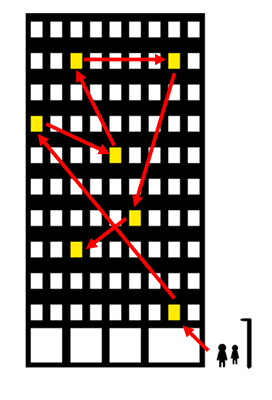

# Linked List

연결리스트는 데이터 변경 속도가 느린 array list의 단점을 보완하기 위한 방법이다.

### 메모리의 구조

데이터를 순서대로 저장하는 array list와는 다르게, linked list는 한 데이터 요소가 다음 데이터 요소를 가리키는 방식으로 이어져있다. 따라서 메모리 안에 모여있는 구조가 필요 없다.

## 장점

> 데이터 변경 속도가 빠르다.

데이터에 index순서가 지정되어있는 것이 아니라, 전 후 요소와의 연결로 순서가 정해져있기 때문에 요소가 추가, 삭제 되어도 다른 요소들을 수정할 필요가 없다.

## 단점

> 데이터 읽기 속도가 느리다.

만약 중간번째의 데이터를 가져오는 작업을 하기 위해서는, 중간까지의 모든 데이터를 거치며 찾아가야한다. 그러므로 데이터 읽기 속도가 느리다.

## 종류

- [단순 열결 리스트]()
- [이중 연결 리스트]()
- [원형 연결 리스트]()