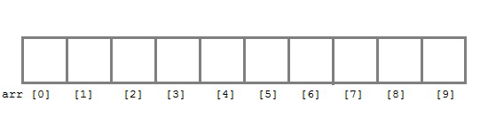
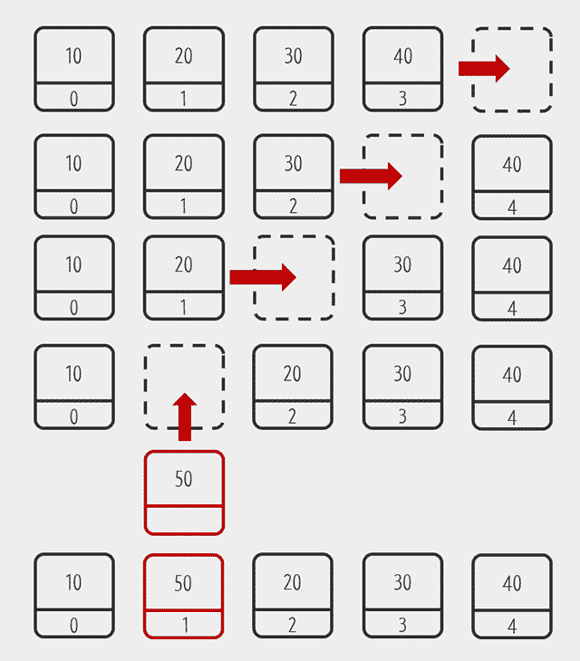
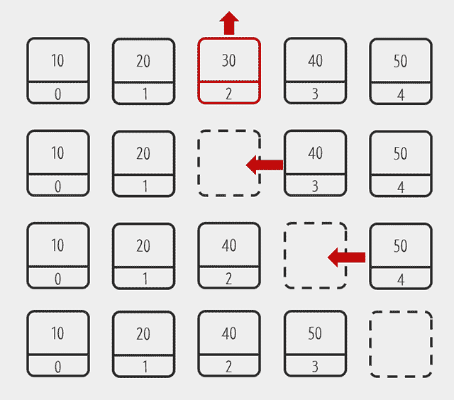

# List(Array List)

> 각 프로그래밍 언어에 리스트가 내장되어 있다면 그것을 사용하는 편이 좋다.

리스트는 다수의 데이터를 그룹핑하여 효율적으로 관리하기 위해 고안된 sequence형 자료구조이다.

각 데이터 요소들은 순서가 있고, 추가, 삭제, 수정할 수 있다.

## 장점

> 데이터를 가져오는 속도가 빠르다.

데이터들의 주소가 메모리상 주소를 정확히 참조해서 가져오기 때문에 속도가 빠르다.

## 단점

> 데이터 변경 속도가 느리다. 단, 데이터 수정은 빠르다.
>
> 단점을 보완하기 위해 [linked list](https://github.com/hojp7874/TIL/DataStructure/Linear/LinkedList.md)가 고안되었다.

### 추가

아래 그림과 같이 데이터를 list 중간에 추가하는 경우 그 뒤에있는 모든 요소들의 index를 1씩 미뤄야하기 때문에 데이터 처리속도가 느리다.

### 삭제

마찬가지로 list 중간의 요소를 삭제할 경우 index를 1씩 당겨야하기 때문에 데이터 처리속도가 느리다.

### 수정

수정은 다른 요소들의 index변경이 이뤄지지 않으므로 처리속도가 빠르다.