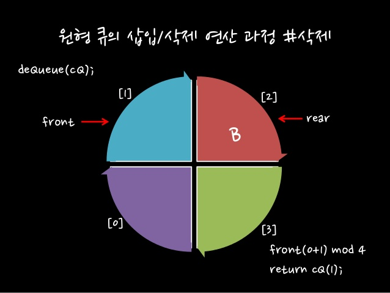
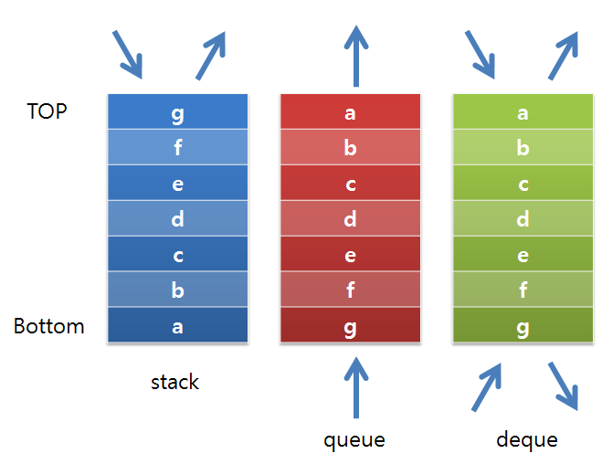

# Queue

> FIFO: 선입선출형 자료구조

## 구조

- front: 큐의 첫 번째 원소. 공백 큐에서는 front == -1이 된다.
- rear: 큐의 마지막 원소. 공백 큐에서는 rear == front가 된다.

## 연산

| 연산        | 기능                                            |
| ----------- | ----------------------------------------------- |
| enQueue     | rear 뒤쪽에 원소를 삽입하는 연산                |
| deQueue     | front에서 원소를 삭제하고 반환하는 연산         |
| createQueue | 공백 상태의 큐를 생성하는 연산                  |
| isEmpty     | 큐가 공백상태인지 확인하는 연산                 |
| isFull      | 큐가 포화상태인지 확인하는 연산                 |
| Queuepeek   | front에 있는 원소를 삭제하지 않고 반환하는 연산 |

- `enQueue`: 원소를 하나 추가하고 rear에 1을 더한다.
- `deQueue`: front에 1을 더하고, front에 있는 원소를 삭제한다.
- `createQueue`: Queue를 생성하고 front, rear를 -1으로 초기화한다.
- `isEmpty`: front == rear이면 True
- `isFull`: front == -1이면 True

## 종류

#### 선형 Queue

위에서 설명한 Queue가 선형Queue의 일반적인 속성이다.

__한계__: data의 삭제를 반복할수록 메모리 효율이 떨어지므로 다른 방식의 Queue들이 고안됐다.

#### 원형 Queue

선형큐에서 메모리 낭비를 보완하기위한 방법으로 고안된 형태.

프로그래밍에서는 index의 나머지를 이용한 방법으로 구현한다.

- 특정 연산이 선형Queue와 약간의 차이가 있다.
  - `isFull`: front + (Queue의 길이 -1) == rear이면 True

- fornt에 위치해있는 Queue는 항상 비어있다.

__한계__: 여전히 메모리가 포화상태가 된다는 문제가 남아있다. 메모리를 무한히 사용하기 위해 또다른 방식의 Queue가 고안됐다.

#### 연결 Queue

Linked List를 사용한 형태이다. 따라서 길이를 무한히 늘릴 수 있다는 장점이 있다.

- 초기상태와 공백상태 모두 front = rear = None이며, 구분할 수 없다.
- 포화상태가 존재하지 않으므로, `isFull`연산 또한 존재하지 않는다.

# Deque

Stack과 Queue의 속성을 융합한 형태로, 양방향에서 출입이 모두 가능한 자료구조이다.

