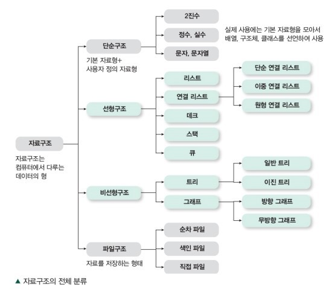

# 자료구조

각종 데이터들을 프로그래밍으로 구현하기 쉽게 표현하는 것.

### 단순구조

- 2진수
- 정수, 실수
- 문자, 문자열

### 선형 구조

- [리스트](https://github.com/hojp7874/TIL/DataStructure/Linear/List.md)
- [연결 리스트](https://github.com/hojp7874/TIL/DataStructure/Linear/LinkedList.md)
- [데크](https://github.com/hojp7874/TIL/DataStructure/Linear/Queue.md)
- [스텍](https://github.com/hojp7874/TIL/DataStructure/Linear/Stack.md)
- [큐](https://github.com/hojp7874/TIL/DataStructure/Linear/Queue.md)

### 비선형구조

- 트리
- 그래프

### 파일구조

- 순차 파일
- 색인 파일
- 직접 파일