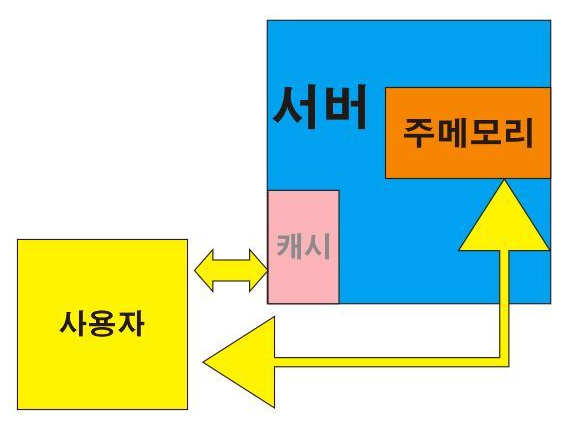

# python 꿀팁

1. `pip`: python in package

2. `vertualenv`: 가상환경

3. `python -m venv venv`: 파이썬명령어로, 가상환경 설정, 이름은 venv. (여기서 m은 make라 추정)

4. `source venv/Scripts/activate`: source 명령어로 가상환경폴더 안의 activate파일 실행

5. `__inti__`: 패키지 폴더 안에 이 파일이 있으면 그것은 패키지라는 것을 알림(국룰)

6. `ASGI`: (Asynchronous Server Gateway Interface 비동기 서버 게이트웨이 인터페이스) 서버, 프레임워크, 어플리케이션을 비동기로 연결해주는 역할

7. `WSGI`: (Web Server Gateway Interface) 웹과 서버를 연결해주는 역할. framework가 처리하는 수많은 request를 최고의 방법으로 처리할 수 있게 해줌

8. `__file__`: 파일이 위치한 경로를 반환

9. `settings.py/DEBUG = True`: 실제 서비스 진행중일때는 False로 두어야 함. 보안의 위험성이 있음.

10. `settings.py/ALOWED_HOSTS = []`: `XSS(Cross Site Scripting)`등에 대비하기 위해 접속을 허용할 호스트명을 등록한다. `IP주소`, `도메인`을 사용할 수 있다.

11. Django의 웹 요청 인증: 세션, 미들웨어

12. 캐시와 쿠키의 차이점:
    

    캐시: 이전에 호출한 정보를 자동으로 복사해 저장하는 임시저장소. 똑같은 사이트를 재방문할 때 로딩시간이 단축되는게 캐시 덕분이다.

    쿠키: 사이트접속내역, 검색기록내역, 다운로드 내역 등의 정보를 클라이언트 PC에 저장.

    세션: 세션에는 특정 아이디가 있음. 그 아이디는 쿠키와 연동되어 클라이언트에게 해당 ID의 쿠키를 요청하고, 쿠키를 받아 실행한다. ex) 로그인 정보 쿠키를 요청하여 새로고침 할때마다 로그인 정보를 입력받아 로그인이 끊기지 않는다.

13. `settings.py/TEMPLATES.OPTIONS.context_processors`: 탬플릿에서 따로 정의하지 않아도 사용할 수 있는 변수를 만들어줌. 
    ex: `request`, `auth`

### 미들웨어란?

- http 요청 / 응답 처리 중간에서 작동하는 시스템이다
- DJango는 **http 요청**이 들어오면 미들웨어를 거쳐서 해당 URL에 등록되어 있는 뷰로 연결해주고, **http 응답** 역시 미들웨어를 거쳐서 내보낸다


- 따라서 Django에서 **미들웨어**는 http 요청 혹은 응답의 전처리에 사용이 된다

### 미들웨어 등록, 설정

- 미들웨어를 등록하는 방법은 setting.py에서 `MIDDLEWARE` 항목에 추가하고자 하는 미들웨어의 **full python path**를 추가해주면 된다
- django-admin startproject 명령어로 django project를 생성하면 기본적으로 미들웨어들이 등록되어 있다

```
1 2 3 4 5 6 7 8 9 10 # setting.py 기본 등록 미들웨어 MIDDLEWARE = [    'django.middleware.security.SecurityMiddleware',    'django.contrib.sessions.middleware.SessionMiddleware',    'django.middleware.common.CommonMiddleware',    'django.middleware.csrf.CsrfViewMiddleware',    'django.contrib.auth.middleware.AuthenticationMiddleware',    'django.contrib.messages.middleware.MessageMiddleware',    'django.middleware.clickjacking.XFrameOptionsMiddleware', ] 
```

### 미들웨어 순서

- 미들웨어 등록시 가장 중요한 것은 미들웨어를 등록하는 순서이다
- 미들웨어 등록 순서가가지는 의미는 다음과 같다
  - http request가 들어오면 **위에서부터 아래로** 미들웨어를 적용시킨다
  - http response가 나갈 때 **아래서부터 위로** 미들웨어를 적용시킨다


