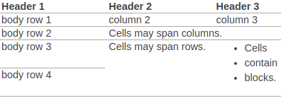
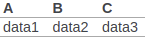

# RST 문법

[TOC]

## HEADER

````````
=======
Header1
=======

Header2
~~~~~~~

Header3
-------

Header4
^^^^^^^

Header5
```````

Header6
'''''''
````````

# Header 1

## Header 2

### Header 3

#### Header 4

##### Header 5

###### Header 6

> rst에서는 header레벨을 임의로 결정할 수 없다.
>
> 먼저 사용한 문법 순서대로 Header1부터 차례로 배정된다.
>
> 그래서 Header1 뒤에 Header3을 넣을 수 없다.

> Header 문자는 키보드의 모든 특수문자를 사용할 수 있다.
>
> ```
> ` - = ~ ! @ # $ % ^ & * ( ) _ + , . / \ < > ? |
> ```
>
> 문자는 헤더의 내용과 같거나 더 길어야 하고, 헤더의 아래 또는 아래와 위에 들어가야 한다.
>
> ```````
> Header		-> o
> =======
> 
> Header		-> x
> =====
> 
> ----------------
> 
> ++++++
> Header		-> o
> ++++++
> 
> Header		-> o
> \\\\\\
> 
> ``````
> Header		-> x
> ```````


## INDEX

```
.. sectnum::

.. contents:: index header sample
```

# index header sample

[1. RST 문법]()

[1.1 HEADER]()

[1.2 INDEX]()

...

> `Markdown` 의 `[TOC]` 와 같은 역할을 한다.
>
> `.. sectnum::` 은 목차의 번호 (1 1.1 1.2 등)을 표시해준다.
>
> `.. contents::` 는 각 헤더들이 링크를 가지며 목차를 정리해주고, 뒤에 있는 텍스트`는 목차 부분의 헤더이다.


## 목록

### ordered

```
1. 목록1
2. 목록2
3. 목록3
```

1. 목록1
2. 목록2
3. 목록3

> 순서가 있는 목록


```
#. 목록1
#. 목록2
#. 목록3
```

1. 목록1
2. 목록2
3. 목록3

> 목록 번호 자동화 가능


```
1. 목록1
    1. 목록1.1
        1. 목록1.1.1
```

1. 목록1
   1. 목록1.1
      1. 목록1.1.1

> 4칸씩 띄우면 들여쓰기 가능


### unordered

```
- 목록
- 목록
- 목록
```

- 목록
- 목록
- 목록

> 순서가 없는 목록


```
- 목록
	- 목록
		- 목록
```

- 목록
  - 목록
    - 목록

> 4칸씩 띄우면 들여쓰기 가능


## 강조

### italic

```
*italic*
```

*italic*

> 기울여 쓰기


### bold

```
**bold**
```

**bold**

> 굵은 글씨


### fixed space font

```
``fixed space font``
```

`fixed space font`

> 글씨가 고정폭을 가진다.


## DIRECTIVE

### Code block

```
.. code:: python

  print('hello, world!')
```


```python
print('hello, world!')
```

> 코드블럭을 만든다.


```
::

  print('hello, world!')
```

```
print('hello, world!')
```

> 이렇게 간단하게도 만들 수 있다.


### Image (figure)

```
.. image:: https://overbits.herokuapp.com/rsteditor/img/logo128.png
    :height: 200
    :width: 200
    :alt: 이미지 설명
```


> 이미지를 띄운다.
>
> `image` 대신 `figure`를 사용할 수도 있다.


### Inline-Directive

```
텍스트 중간에 |이미지| 나 |아이콘| 을 사용할 수 있다.

.. |이미지| image:: https://overbits.herokuapp.com/rsteditor/img/logo128.png

.. |아이콘| image:: https://cdn.icon-icons.com/icons2/1462/PNG/512/111settings_99949.png
    :width: 20
```

텍스트 중간에 나 을 사용할 수 있다.


## TABLE

### Simple Table

```
===== ===== ======
   Inputs   Output
----------- ------
  A     B   A or B
===== ===== ======
False False False
True  False True
False True  True
True  True  True
===== ===== ======
```


> 단순한 형태의 테이블을 만들 수 있다.


### Grid Table

```
+------------+------------+-----------+
| Header 1   | Header 2   | Header 3  |
+============+============+===========+
| body row 1 | column 2   | column 3  |
+------------+------------+-----------+
| body row 2 | Cells may span columns.|
+------------+------------+-----------+
| body row 3 | Cells may  | - Cells   |
+------------+ span rows. | - contain |
| body row 4 |            | - blocks. |
+------------+------------+-----------+
```



> 테이블 형태를 유동적으로 만들 수 있다.


### List Table

```
.. list-table::
  :header-rows: 1

  * - A
    - B
    - C
  * - data1
    - data2
    - data3
```



> 간단하게 리스트 형식으로 테이블을 만들 수도 있다.


### CSV Table

```
.. csv-table:: Frozen Delights!
   :header: "Treat", "Quantity", "Description"
   :widths: 15, 10, 30   
   
   "Albatross", 2.99, "On a stick!"
   "Crunchy Frog", 1.49, "If we took the bones out, it wouldn't be
   crunchy, now would it?"
   "Gannet Ripple", 1.99, "On a stick!"
```


> csv 형식으로 테이블을 만들 수 있다.
>
> 아래의 방식처럼 경로로부터 csv 파일을 읽어올 수도 있다.
>
> ```
> .. csv-table:: Table Title
> 	:file: <CSV file path>
> 	:widths: 30, 70
> 	:header-rows: 1
> ```


### 단락구분선

```
----
```

----

> 수평선을 그어 단락을 구분해준다.


참고문헌

https://thomas-cokelaer.info/tutorials/sphinx/rest_syntax.html

