# Pibo H/W Structure

[TOC]

## Parts

### Units

- ATMega328p
- Servo motor
- Neopixel
- Amp
- OLED
- Speaker
- Voltage Regulator

#### ATMega328p

`MCU`이다.

> MCU(Micro Controller Unit)란? `Microprocessor`와 입출력 모듈을 하나의 칩으로 만들어 정해진 기능을 수행하는 컴퓨터이다.
>
> > Microprocessor(초소형 연산 처리 장치)란? 컴퓨터의 CPU를 말한다.
>
> MCU는 임베디드 앱을 위해 디자인되었다. 일반 PC와의 차이점은 PC는 다양한 일을 하기 위해 고안되었지만, MCU는 정해진 일을 하도록 고안되었다. 따라서 PC보다 성능이 낮고 형상도 다르다. (냉장고, 전자렌지 등에 사용된다.)

[아두이노 우노에서 머리 역할을 수행한다.](https://mosesnah.tistory.com/1)

#### Servo motor

TMI. Servo의 어원은 라틴어의 Servue(영어의 Slave)로, 노예처럼 충실히 육체노동을 하는 모터라는 뜻이다 ㅎㅎ

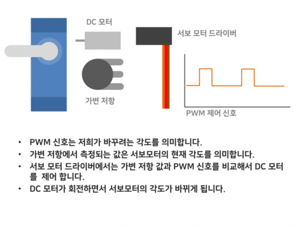

위 그림은 DC, 일반 서보모터의 예시이다.

모터가 움직이면 저항의 길이가 바뀌며(R = rho*L/A에 따라) 저항값이 달라지는 특성을 이용해 현재 각도를 알 수 있다.

또한 입력 신호를 PWM을 이용해 아날로그로 받을 수 있기 때문에 목표각도를 표현할 수 있고, 모터가 어느 방향으로 움직여야하는지 입력된다.

모터가 움직이며 현재 각도가 목표 각도와 일치하면 작동을 정지한다.

#### Neopixel

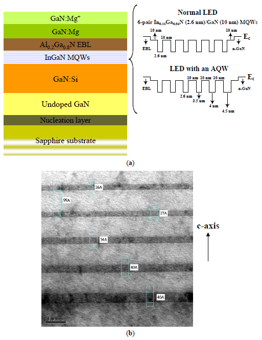

LED는 대략 20개 전후의 layer로 이루어져있는데(제조사마다 다름), 이 중 MQW 범위의 층에서 빛이 발생한다.

발생하는 원리는 양 극단에 전압이 가해지면 전자가 안정화 되면서 전자기파를 방출한다.

이 때 발생하는 전자기파는 특정 파장의 빛이다. (파장은 MQW층에 의해 정해짐)

그래서 각각의 LED는 정해진 색깔의 빛을 방출할 수 밖에 없다.

더욱 다양한 색을 내기 위해서는 RGB 3가지 색의 빛을 방출하는 LED가 각각 필요한데, 이를 모아 디지털신호로 컨트롤 할 수 있게 한 것이 `Neopixel`이다.

#### Amp(증폭기, Amplifier)

transister를 사용한 증폭기

보류

- 오디오 신호를 증폭하는 역할을 한다.

#### OLED(유기발광다이오드, Organic Light Emitting Diode)

https://blog.naver.com/seoduddl/50085170755

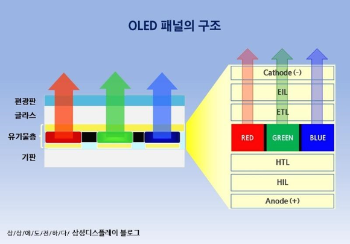

LED와 발광원리는 같으나 그 재료가 다르다.(LED는 무기물, OLED는 유기물)

증착과정에도 차이가 있는데, LED는 사파이어 wafer에 증착시킨다. 이유는 GaN과 격자구조가 비슷하면서(약간의 차이는 있다.) 가격이 저렴하고 열 응력이 높기 때문이다. 물론 GaN(LED와 물성이 같음)을 사용하는게 LED 성능에는 가장 좋겠지만 너무 비싸다.

반면, OLED는 유리기판에도 증착이 가능하다. 물성이 뭔지는 모르겠는데,,, 휘어지는 display도 제작되고 하는걸 보니 유리 외 다양한 대상에 증착이 되는가 싶다. 무기물 기반 LED보다 더 낮은 온도에서 쉽게 증착이 가능하여 OLED display를 제작할 수 있다. (LED display는 엄밀히 LED가 아니니까...)

PMOLED와 AMOLED로 구분되며, PMOLED는 발광소자 하나가 통째로 제어되기 때문에 소자당 LED를 하나씩 부착할 수 밖에 없다.

반면, AMOLED는 픽셀 내부의 OLED를 각각 제어할 수 있기 때문에 (TFT, Thin Film Transister로 제어) 대형화가 용이하다.(디스플레이 구조가 심플해져서 그런 것 같음. 대신 TFT에 돈이들어감.)

#### Speaker

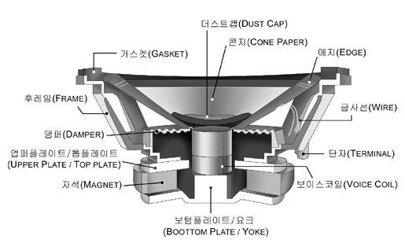

스피커이다. ㅎㅎ

코일에 전기신호 입력 -> 자기장 생성 -> 자석과 코일 사이 힘 작용(자기력 FBI) -> 진동판 떨림 -> 공기의 진동 -> 음파

간단하다.

#### Voltage Regulator

전압을 변환하는 장치로, LDO방식과 Switching방식으로 구분된다.

LDO(Low Dropout)방식은 입력보다 출력 전압이 낮을 때 가능하며, 입출력 전위차가 작을수록 효율이 좋다.

- 모델명: AMS1117
- 12V의 전압을 5V로 변환해주는 역할을 한다.

### Sensor

- PIR
- Touch
- MEMS MIC

#### PIR (적외선 인체감지 센서, Passive Infrared Sensor)

- 사람의 몸에서 방사되는 __적외선을 센싱__하여 움직임의 유무를 판단.
- 편광 필터 덮개
- 건물 복도 등에 주로 사용됨

__동작 원리__

인체에서 발생하는 자외선을 감지하여 사람의 유무를 판단한다.

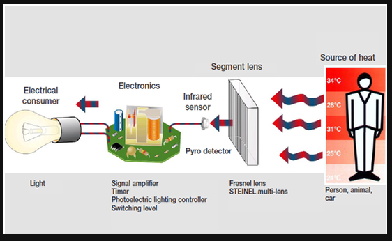

- `Fresnel lens`: 인체에서 방사되는 적외선이 `Fresnel lens`를 통해 `infrared sensor(PIR)`에 닿는다.
  (`Fresnel lens`는 빛을 모아주는 역할을 하는데, 이게 없으면 직진성이 강한 감지방식의 특성상 감지영역의 폭이 좁고 가까운 인체만 감지할 수 밖에 없다.)

- `Segment lens`: 편광필터로, 특정 구간의 파장만 통과할 수 있도록 해준다.

  인체에서 방사되는 파장은 `9~10` micro meter이고, 일반적으로 PIR 센서의 감지범위는 `8~14`micro meter이다.

#### Touch Sensor

- 모델명: BS812A-1
- 정전식 터치센서인가?

#### MEMS MIC

원래 알고있던 마이크와는 다르게 진동판같은게 없다!

MEMS는 Micro Electro Mechanical Systems, 미세 전자기계 시스템.

센서 백플레이트는 천공구조로 공기가 쉽게 빠져나가며, 반면 멤브레인은 얇은 고형 구조로 음파에 의한 대기압 변화에 반응해 움직인다.

멤브레인은 움직이고, 백플레이트는 정지되므로 이 둘 사이의 캐패시턴스의 변화를 측정해 전기신호로 변환한다.

## Network

- SPI
- I2S
- PWM
- Digital IO
- USB Serial
- Soft Serial

#### SPI (직렬 주변기기 인터페이스, Serial Peripheral Interface)

SPI란? __Motorola__ 회사가 처음 고안한 통신방법.(1980년도에 개발했으며, 현재는 구글에 합병되었다.)

`MCU`와 주변 장치간의 `Serial 통신`을 위한 규약이다.

> MCU란? Micro Controller Unit으로, CPU의 기능을 하는 핵심장치와 그 주변 장치들을 포함하고 있는 통합형 칩셋.
>
> 이 소형칩(micro unit) 하나만으로 LED나 모터와 같은 다른 부품들을 제어할 수 있다.
>
> -> [MCU, MPU, CPU 차이 이해하기](https://www.hackerschool.org/Sub_Html/HS_University/HardwareHacking/06.html)

> Serial 통신이란? 하나의 신호선을 이용해 데이터를 주고받는 통신이다. (모스부호같은 거)
>
> 하나의 신호선을 이용하다보니 시간 순으로 데이터를 전송해야 해서 느리다는 단점이 있다.
>
> 반면 신호선이 적어 저렴하다는 장점이 있다.

외부 주변장치와 `Clock`을 통해 동기화하는 동기식 통신방식이며,  하나의 Master와 하나 이상의 Slave Device간의 통신 방식입니다.

> Clock 신호란? 1과 0이 주기적으로 나타나는 방형파(square wave) 신호를 말한다.
>
> 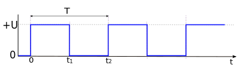

__SPI 통신의 장점__

- 완전한 전이중(Full duplex) 통신: 송수신이 동시에 가능하다.

- 전송되는 비트에 대한 완전한 프로토콜 유연성: 최대 16비트까지 마음대로 길이를 조작할 수 있다.

- 전송기가 필요하지 않음: 흔히 말하는 `트랜시버`를 사용할 필요가 없다.

  > 트랜시버란? 전송기와 수신기를 하나로 합친 장치이다.

- 매우 단순한 하드웨어 인터페이스 처리: 때문에 단순한 센서나 메모리에서 많이 사용한다.

- IC 패키지에 4개의 핀만 사용한다.

- 1대 다 통신을 지원한다.

- I2C에 비해 빠르다.

__SPI 통신의 단점__

- 하드웨어 슬레이브 인식이 없다. ?? 무슨말이지??

- 슬레이브에 의한 하드웨어 흐름제어가 없다.

  > 흐름제어(flow control)란? 확인 응답을 받기 전에 전송할 수 있는 데이터의 양을 조정하는 것.
  >
  > 수신기가 처리할 수 있는 데이터의 양은 한계가 있으므로, 이 데이터보다 더 많은 양의 데이터가 들어오지 못하게 조절해준다.

- 오류 검사 프로토콜이 정의되어 있지 않다.

  > 오류검사 프로토콜: 네트워크 등을 통해 비트 프레임 단위로 데이터를 통신할 때 전송된 데이터에 오류가 있는지 확인하기 위해 방법이 여러가지가 있다. (Parity check, CRC 등)
  >
  > Parity check의 경우, 프레임 끝에 추가비트(패리티 비트)를 각 단어 끝에 붙여, 단어의 1의 개수가 짝수인지 홀수인지에 따라 패리티 비트를 결정해 보낸다.

- 노이즈 스파이크에 영향을 받는 경향이 있다.

  > Surge(노이즈, 스파이크, 임펄스 등)란? 매우 짧은 시간동안 나타났다가 사라지는 고전압 대전류의 전기적인 동요현상.

- RS-232, CAN 버스보다 비교적 더 짧은 거리에서 동작.(칩간 통신에서만 주로 사용한다.)

- 하나의 마스터 장치만 지원한다.

__I2C vs SPI__

https://m.blog.naver.com/PostView.naver?isHttpsRedirect=true&blogId=fribot&logNo=220060422314

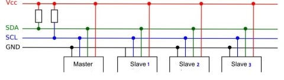

I2C는 4개의 선이 있다. 이 중 Vcc, GND는 전원공급용이고, 데이터 통신은 SDA, SCL이다.

그리고 이 중 SCL은 클럭신호용이므로 실제 데이터의 송수신은 SDA 하나라고 볼 수 있다.

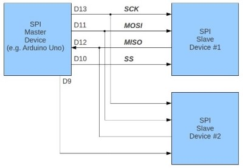

반면 SPI는 데이터 송수신이 MOSI, MISO 두 개로 나뉘어진다. 따라서 I2C보다 통신속도가 빠르다.

그림을 보면 알 수 있는데, 센서 추가 시 복잡도에 대해서도 알 수 있다.

I2C는 그냥 버스선에 새로운 센서를 연결하면 끝이지만, SPI는 추가선이 필요하다.

#### I2S(Intergrated Interchip Sound)

PCB보드 내에서 칩간 통신을 하는 방법(I2S, I2C, SPI, CAN, UART) 중 하나.

__I2S__의 통신규격은 Audio 전용규격이다. 통상적으로 MCU에서 사운드 칩을 제어하는데, 칩제어는 I2C로 하고 소리는 I2S로 하는게 일반적이다.

#### PWM(Pulse Width Modulation)

https://thrillfighter.tistory.com/589

아날로그 신호를 디지털 신호로 표현하는 방법이다.

기존의 servo moter를 작동하면 입력신호는 1 또는 0 이므로 `작동` 또는 `정지`밖에 못 한다.

그러나 PWM을 사용하면, 모터의 `작동`과 `정지`를 임의의 비율로 빠르게 반복하여 마치 아날로그 신호를 받은 것 처럼(10%출력, 30%출력, 80%출력 등) 가동할 수 있다.

> 100%, 50% 출력
>
> 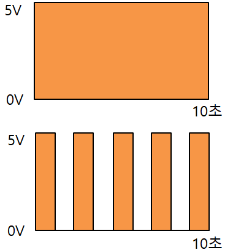

> 50% 출력
>
> 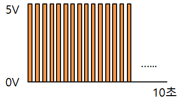

> 20% 출력
>
> 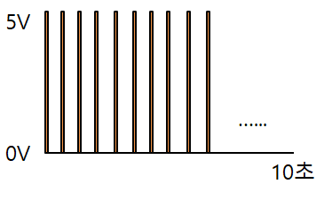

#### DIO

digital input / output

#### USB Serial

USB 연결

#### Soft Serial

serial 포트가 모자랄 때 `RX, TX`핀으로 동작할 수 있게 해주는 라이브러리이다.

> 데이터를 수신하는 핀은 rx, 데이터가 송신되는 핀은 tx라고 부른다.
>
> 간혹 rx와 tx가 합쳐진 경우가 있다.

일반 GPIO를 Serial로 사용할 수 있도록 software적으로 프로그래밍 하는 것을 일컫는다.

## 출처

[PIR 센서 1](https://m.blog.naver.com/PostView.naver?isHttpsRedirect=true&blogId=eduino&logNo=220892296492)

[PIR 센서 2](https://m.blog.naver.com/kkkcw/220908064366)

[SPI 통신](https://treeroad.tistory.com/entry/SPI-%ED%86%B5%EC%8B%A0-1)

[PWM의 원리](https://thrillfighter.tistory.com/589)

[시리얼 통신의 개념](https://m.blog.naver.com/PostView.naver?isHttpsRedirect=true&blogId=ryuvsken&logNo=65454594)

[MCU에 대하여](https://ko.wikipedia.org/wiki/%EB%A7%88%EC%9D%B4%ED%81%AC%EB%A1%9C%EC%BB%A8%ED%8A%B8%EB%A1%A4%EB%9F%AC)

[서보모터](http://makeshare.org/bbs/board.php?bo_table=arduinomotor&wr_id=8)

