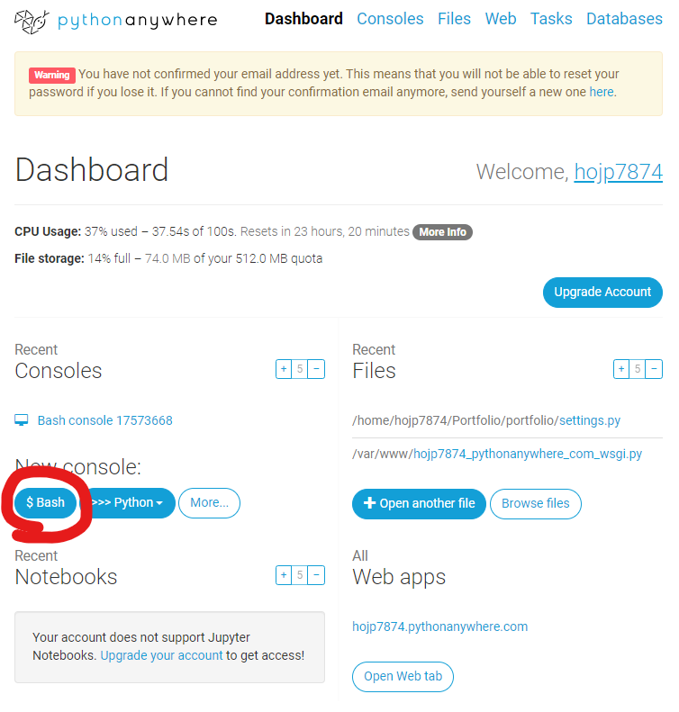
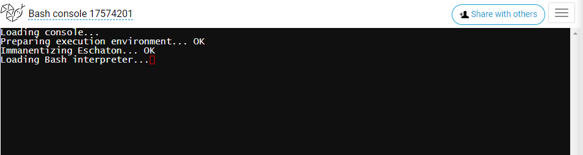

# Django server host

> `Pythonanywhere`라는 사이트를 이용해 쉽고 빠르게 `Django` 서버를 호스팅 할 수 있다.

### 0. `Pythonanywhere`에 가입한다.

### 1. 콘솔을 생성한다.

> 나는 Bash 콘솔이 익숙하니까 Bash로 콘솔을 생성한다.
>
> 
>
> 그러면 이렇게 Bash창이 뜨는데, 여기서 `git hub`에 올려놨던 레포지토리를 pull한다.